# Mermaid Diagrams for ToothyMate Thesis

Copy these Mermaid codes and paste them into:
- https://mermaid.live/ (online editor)
- Or any Mermaid-compatible tool to generate the diagrams

---

## 1. Agile Development Cycle Diagram

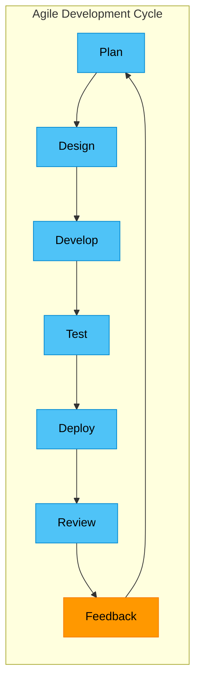
```mermaid
flowchart LR
    subgraph cycle["Agile Development Cycle"]
        A[Plan] --> B[Design]
        B --> C[Develop]
        C --> D[Test]
        D --> E[Deploy]
        E --> F[Review]
        F --> G[Feedback]
        G --> A
    end

    style A fill:#4FC3F7,stroke:#0288D1,color:#000
    style B fill:#4FC3F7,stroke:#0288D1,color:#000
    style C fill:#4FC3F7,stroke:#0288D1,color:#000
    style D fill:#4FC3F7,stroke:#0288D1,color:#000
    style E fill:#4FC3F7,stroke:#0288D1,color:#000
    style F fill:#4FC3F7,stroke:#0288D1,color:#000
    style G fill:#FF9800,stroke:#F57C00,color:#000
```

---

## 1b. Project Phases Timeline (Matching Gantt Chart)

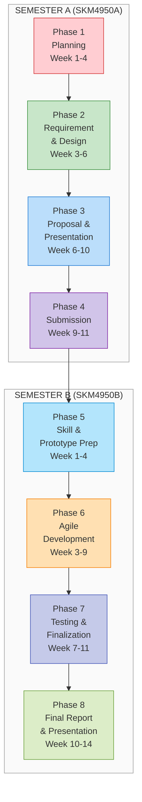
```mermaid
flowchart TB
    subgraph SemA["SEMESTER A (SKM4950A)"]
        P1[Phase 1<br/>Planning<br/>Week 1-4]
        P2[Phase 2<br/>Requirement<br/>& Design<br/>Week 3-6]
        P3[Phase 3<br/>Proposal &<br/>Presentation<br/>Week 6-10]
        P4[Phase 4<br/>Submission<br/>Week 9-11]

        P1 --> P2 --> P3 --> P4
    end

    subgraph SemB["SEMESTER B (SKM4950B)"]
        P5[Phase 5<br/>Skill &<br/>Prototype Prep<br/>Week 1-4]
        P6[Phase 6<br/>Agile<br/>Development<br/>Week 3-9]
        P7[Phase 7<br/>Testing &<br/>Finalization<br/>Week 7-11]
        P8[Phase 8<br/>Final Report<br/>& Presentation<br/>Week 10-14]

        P5 --> P6 --> P7 --> P8
    end

    P4 --> P5

    style P1 fill:#FFCDD2,stroke:#D32F2F
    style P2 fill:#C8E6C9,stroke:#388E3C
    style P3 fill:#BBDEFB,stroke:#1976D2
    style P4 fill:#D1C4E9,stroke:#7B1FA2
    style P5 fill:#B3E5FC,stroke:#0288D1
    style P6 fill:#FFE0B2,stroke:#F57C00
    style P7 fill:#C5CAE9,stroke:#3F51B5
    style P8 fill:#DCEDC8,stroke:#689F38

    style SemA fill:#FAFAFA,stroke:#9E9E9E
    style SemB fill:#FAFAFA,stroke:#9E9E9E
```

---

## 1c. Agile Development Iterations (Phase 6)

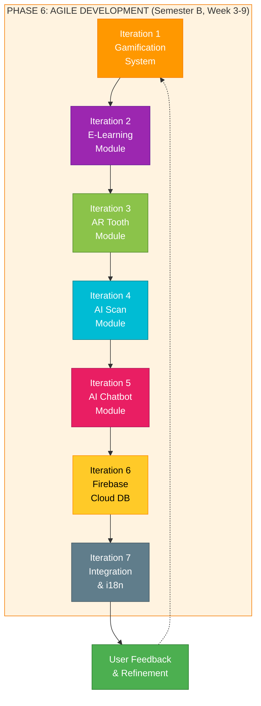
```mermaid
flowchart TB
    subgraph Phase6["PHASE 6: AGILE DEVELOPMENT (Semester B, Week 3-9)"]
        I1[Iteration 1<br/>Gamification<br/>System]
        I2[Iteration 2<br/>E-Learning<br/>Module]
        I3[Iteration 3<br/>AR Tooth<br/>Module]
        I4[Iteration 4<br/>AI Scan<br/>Module]
        I5[Iteration 5<br/>AI Chatbot<br/>Module]
        I6[Iteration 6<br/>Firebase<br/>Cloud DB]
        I7[Iteration 7<br/>Integration<br/>& i18n]

        I1 --> I2 --> I3 --> I4 --> I5 --> I6 --> I7
    end

    FB[User Feedback<br/>& Refinement]
    I7 --> FB
    FB -.-> I1

    style I1 fill:#FF9800,stroke:#F57C00,color:#fff
    style I2 fill:#9C27B0,stroke:#6A1B9A,color:#fff
    style I3 fill:#8BC34A,stroke:#558B2F,color:#fff
    style I4 fill:#00BCD4,stroke:#00838F,color:#fff
    style I5 fill:#E91E63,stroke:#AD1457,color:#fff
    style I6 fill:#FFCA28,stroke:#FF8F00,color:#000
    style I7 fill:#607D8B,stroke:#455A64,color:#fff
    style FB fill:#4CAF50,stroke:#2E7D32,color:#fff

    style Phase6 fill:#FFF3E0,stroke:#F57C00
```

---

## 1d. Project Gantt Chart (Matching Your Timeline)

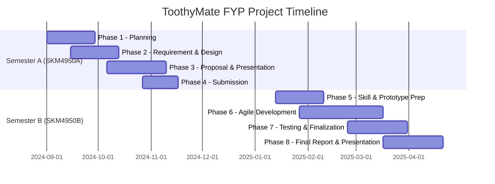
```mermaid
gantt
    title ToothyMate FYP Project Timeline
    dateFormat  YYYY-MM-DD

    section Semester A (SKM4950A)
    Phase 1 - Planning                      :p1, 2024-09-01, 28d
    Phase 2 - Requirement & Design          :p2, 2024-09-15, 28d
    Phase 3 - Proposal & Presentation       :p3, 2024-10-06, 35d
    Phase 4 - Submission                    :p4, 2024-10-27, 21d

    section Semester B (SKM4950B)
    Phase 5 - Skill & Prototype Prep        :p5, 2025-01-13, 28d
    Phase 6 - Agile Development             :p6, 2025-01-27, 49d
    Phase 7 - Testing & Finalization        :p7, 2025-02-24, 35d
    Phase 8 - Final Report & Presentation   :p8, 2025-03-17, 35d
```

---

## 2. System Architecture Diagram

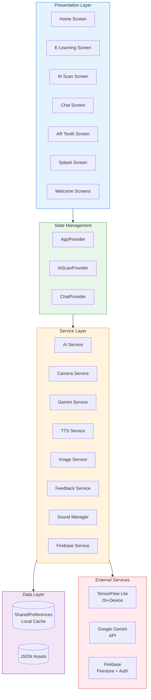
```mermaid
flowchart TB
    subgraph PL["Presentation Layer"]
        HS[Home Screen]
        ELS[E-Learning Screen]
        AIS[AI Scan Screen]
        CS[Chat Screen]
        ARS[AR Tooth Screen]
        SS[Splash Screen]
        WS[Welcome Screens]
    end

    subgraph SM["State Management"]
        AP[AppProvider]
        ASP[AiScanProvider]
        CP[ChatProvider]
    end

    subgraph SL["Service Layer"]
        AISvc[AI Service]
        CamSvc[Camera Service]
        GemSvc[Gemini Service]
        TTSSvc[TTS Service]
        ImgSvc[Image Service]
        FeedSvc[Feedback Service]
        SndMgr[Sound Manager]
        FBSvc[Firebase Service]
    end

    subgraph DL["Data Layer"]
        SP[(SharedPreferences<br/>Local Cache)]
        JSON[(JSON Assets)]
    end

    subgraph ES["External Services"]
        TFL[TensorFlow Lite<br/>On-Device]
        GEM[Google Gemini<br/>API]
        FB[Firebase<br/>Firestore + Auth]
    end

    PL --> SM
    SM --> SL
    SL --> DL
    SL --> ES

    style PL fill:#E3F2FD,stroke:#1976D2
    style SM fill:#E8F5E9,stroke:#388E3C
    style SL fill:#FFF3E0,stroke:#F57C00
    style DL fill:#F3E5F5,stroke:#7B1FA2
    style ES fill:#FFEBEE,stroke:#D32F2F
```

---

## 3. Application Main Flowchart

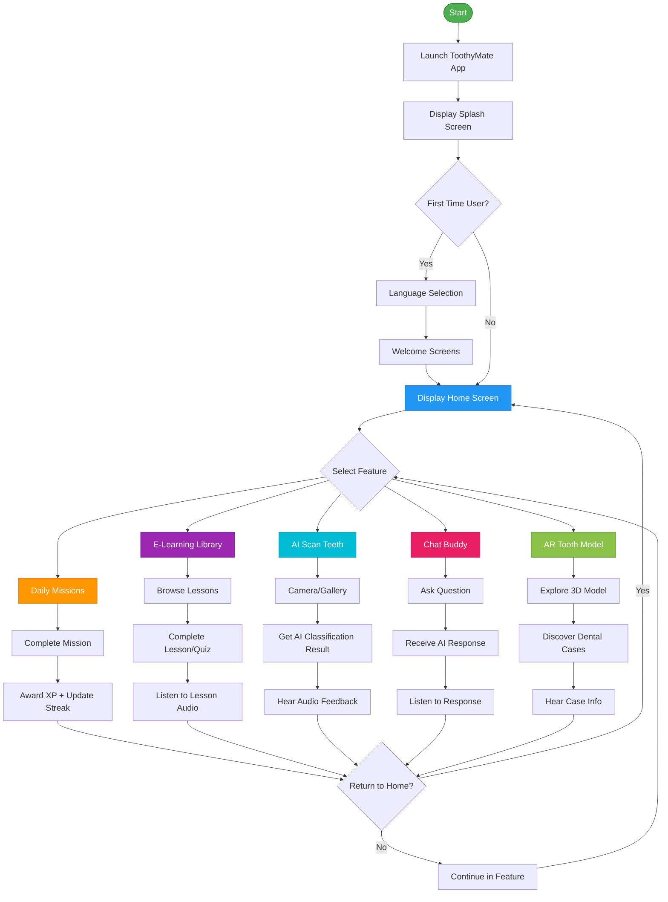
```mermaid
%%{init: {'themeVariables': { 'fontSize': '20px'}}}%%
flowchart TD
    A([Start]) --> B[Launch ToothyMate App]
    B --> C[Display Splash Screen]
    C --> D{First Time User?}

    D -->|Yes| E[Language Selection]
    E --> F[Welcome Screens]
    F --> G[Display Home Screen]

    D -->|No| G

    G --> H{Select Feature}

    H --> I[Daily Missions]
    H --> J[E-Learning Library]
    H --> K[AI Scan Teeth]
    H --> L[Chat Buddy]
    H --> M[AR Tooth Model]

    I --> I1[Complete Mission]
    I1 --> I2[Award XP + Update Streak]

    J --> J1[Browse Lessons]
    J1 --> J2[Complete Lesson/Quiz]
    J2 --> J3[Listen to Lesson Audio]

    K --> K1[Camera/Gallery]
    K1 --> K2[Get AI Classification Result]
    K2 --> K3[Hear Audio Feedback]

    L --> L1[Ask Question]
    L1 --> L2[Receive AI Response]
    L2 --> L3[Listen to Response]

    M --> M1[Explore 3D Model]
    M1 --> M2[Discover Dental Cases]
    M2 --> M3[Hear Case Info]

    I2 --> N{Return to Home?}
    J3 --> N
    K3 --> N
    L3 --> N
    M3 --> N

    N -->|Yes| G
    N -->|No| O[Continue in Feature]
    O --> H

    style A fill:#4CAF50,stroke:#2E7D32,color:#fff
    style G fill:#2196F3,stroke:#1565C0,color:#fff
    style I fill:#FF9800,stroke:#EF6C00,color:#fff
    style J fill:#9C27B0,stroke:#6A1B9A,color:#fff
    style K fill:#00BCD4,stroke:#00838F,color:#fff
    style L fill:#E91E63,stroke:#AD1457,color:#fff
    style M fill:#8BC34A,stroke:#558B2F,color:#fff
```

---

## 4. Use Case Diagram

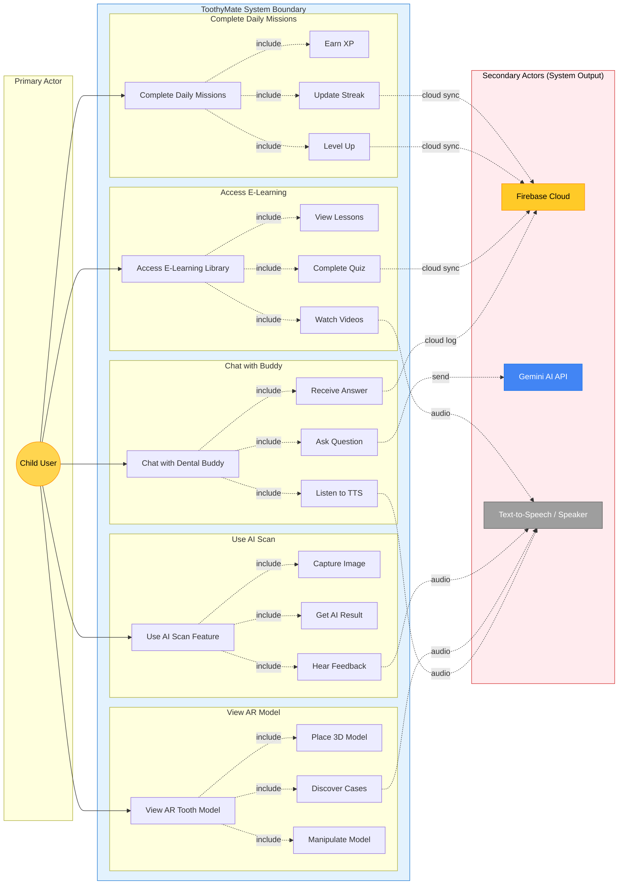
```mermaid
flowchart LR
    subgraph UserSide ["Primary Actor"]
        U((Child User))
    end

    subgraph ToothyMate["ToothyMate System Boundary"]
        subgraph UC1["Complete Daily Missions"]
            DM[Complete Daily Missions]
            DM1[Earn XP]
            DM2[Update Streak]
            DM3[Level Up]
        end

        subgraph UC2["Access E-Learning"]
            EL[Access E-Learning Library]
            EL1[View Lessons]
            EL2[Complete Quiz]
            EL3[Watch Videos]
        end

        subgraph UC3["Use AI Scan"]
            AI[Use AI Scan Feature]
            AI1[Capture Image]
            AI2[Get AI Result]
            AI3[Hear Feedback]
        end

        subgraph UC4["View AR Model"]
            AR[View AR Tooth Model]
            AR1[Place 3D Model]
            AR2[Discover Cases]
            AR3[Manipulate Model]
        end

        subgraph UC5["Chat with Buddy"]
            CH[Chat with Dental Buddy]
            CH1[Ask Question]
            CH2[Receive Answer]
            CH3[Listen to TTS]
        end
    end

    subgraph ExternalSide ["Secondary Actors (System Output)"]
        FB[Firebase Cloud]
        GEM[Gemini AI API]
        TTS[Text-to-Speech / Speaker]
    end

    U --> DM
    U --> EL
    U --> AI
    U --> AR
    U --> CH

    DM -.->|include| DM1
    DM -.->|include| DM2
    DM -.->|include| DM3
    DM2 -.->|cloud sync| FB
    DM3 -.->|cloud sync| FB

    EL -.->|include| EL1
    EL -.->|include| EL2
    EL -.->|include| EL3
    EL2 -.->|cloud sync| FB
    EL3 -.->|audio| TTS

    AI -.->|include| AI1
    AI -.->|include| AI2
    AI -.->|include| AI3
    AI3 -.->|audio| TTS

    AR -.->|include| AR1
    AR -.->|include| AR2
    AR -.->|include| AR3
    AR2 -.->|audio| TTS

    CH -.->|include| CH1
    CH -.->|include| CH2
    CH -.->|include| CH3
    CH1 -.->|send| GEM
    CH2 -.->|cloud log| FB
    CH3 -.->|audio| TTS

    style U fill:#FFD54F,stroke:#FF8F00,color:#000
    style ToothyMate fill:#E3F2FD,stroke:#1976D2
    style ExternalSide fill:#FFEBEE,stroke:#D32F2F,color:#000
    style FB fill:#FFCA28,stroke:#FF8F00,color:#000
    style GEM fill:#4285F4,stroke:#1A73E8,color:#fff
    style TTS fill:#9E9E9E,stroke:#616161,color:#fff
```

---

## 5. AI Classification Data Flow Diagram

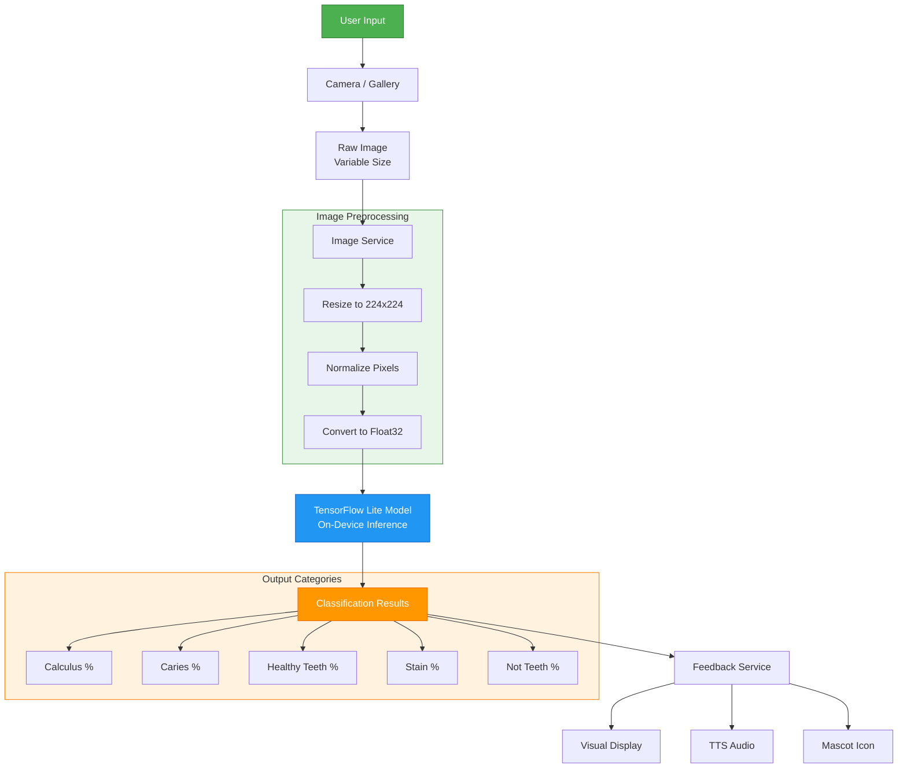
```mermaid
flowchart TD
    A[User Input] --> B[Camera / Gallery]
    B --> C[Raw Image<br/>Variable Size]

    C --> D[Image Service]

    subgraph preprocessing["Image Preprocessing"]
        D --> D1[Resize to 224x224]
        D1 --> D2[Normalize Pixels]
        D2 --> D3[Convert to Float32]
    end

    D3 --> E[TensorFlow Lite Model<br/>On-Device Inference]

    E --> F[Classification Results]

    subgraph results["Output Categories"]
        F --> F1[Calculus %]
        F --> F2[Caries %]
        F --> F3[Healthy Teeth %]
        F --> F4[Stain %]
        F --> F5[Not Teeth %]
    end

    F --> G[Feedback Service]

    G --> H[Visual Display]
    G --> I[TTS Audio]
    G --> J[Mascot Icon]

    style A fill:#4CAF50,stroke:#2E7D32,color:#fff
    style E fill:#2196F3,stroke:#1565C0,color:#fff
    style F fill:#FF9800,stroke:#EF6C00,color:#fff
    style preprocessing fill:#E8F5E9,stroke:#388E3C
    style results fill:#FFF3E0,stroke:#F57C00
```

---

## 6. AR Module Flowchart

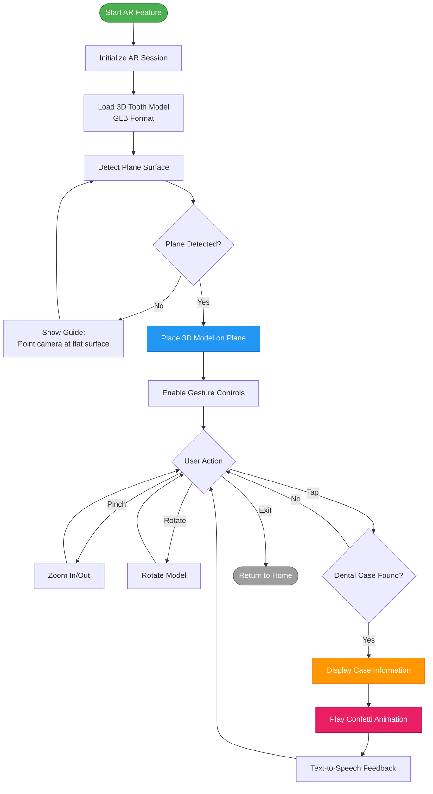
```mermaid
flowchart TD
    A([Start AR Feature]) --> B[Initialize AR Session]
    B --> C[Load 3D Tooth Model<br/>GLB Format]
    C --> D[Detect Plane Surface]

    D --> E{Plane Detected?}
    E -->|No| F[Show Guide:<br/>Point camera at flat surface]
    F --> D

    E -->|Yes| G[Place 3D Model on Plane]
    G --> H[Enable Gesture Controls]

    H --> I{User Action}

    I -->|Pinch| J[Zoom In/Out]
    I -->|Rotate| K[Rotate Model]
    I -->|Tap| L{Dental Case Found?}

    J --> I
    K --> I

    L -->|Yes| M[Display Case Information]
    M --> N[Play Confetti Animation]
    N --> O[Text-to-Speech Feedback]
    O --> I

    L -->|No| I

    I -->|Exit| P([Return to Home])

    style A fill:#4CAF50,stroke:#2E7D32,color:#fff
    style G fill:#2196F3,stroke:#1565C0,color:#fff
    style M fill:#FF9800,stroke:#EF6C00,color:#fff
    style N fill:#E91E63,stroke:#AD1457,color:#fff
    style P fill:#9E9E9E,stroke:#616161,color:#fff
```

---

## 7. Gamification System Flowchart

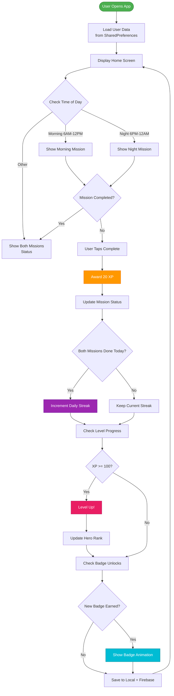
```mermaid
flowchart TD
    A([User Opens App]) --> B[Load User Data<br/>from SharedPreferences]
    B --> C[Display Home Screen]

    C --> D{Check Time of Day}

    D -->|Morning 6AM-12PM| E[Show Morning Mission]
    D -->|Night 6PM-12AM| F[Show Night Mission]
    D -->|Other| G[Show Both Missions<br/>Status]

    E --> H{Mission Completed?}
    F --> H

    H -->|No| I[User Taps Complete]
    I --> J[Award 20 XP]
    J --> K[Update Mission Status]

    K --> L{Both Missions Done Today?}
    L -->|Yes| M[Increment Daily Streak]
    L -->|No| N[Keep Current Streak]

    M --> O[Check Level Progress]
    N --> O

    O --> P{XP >= 100?}
    P -->|Yes| Q[Level Up!]
    Q --> R[Update Hero Rank]
    R --> S[Check Badge Unlocks]

    P -->|No| S

    S --> T{New Badge Earned?}
    T -->|Yes| U[Show Badge Animation]
    T -->|No| V[Save to Local + Firebase]

    U --> V
    V --> C

    H -->|Yes| G

    style A fill:#4CAF50,stroke:#2E7D32,color:#fff
    style J fill:#FF9800,stroke:#EF6C00,color:#fff
    style Q fill:#E91E63,stroke:#AD1457,color:#fff
    style M fill:#9C27B0,stroke:#6A1B9A,color:#fff
    style U fill:#00BCD4,stroke:#00838F,color:#fff
```

---

## 8. E-Learning Module Flowchart

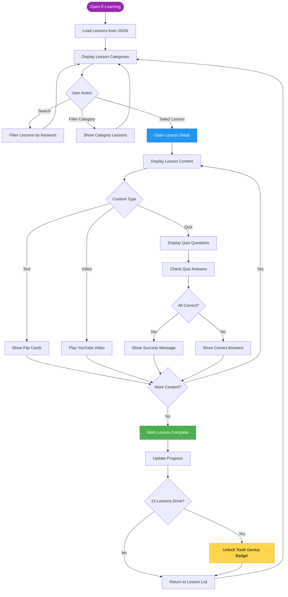
```mermaid
flowchart TD
    A([Open E-Learning]) --> B[Load Lessons from JSON]
    B --> C[Display Lesson Categories]

    C --> D{User Action}

    D -->|Search| E[Filter Lessons by Keyword]
    D -->|Filter Category| F[Show Category Lessons]
    D -->|Select Lesson| G[Open Lesson Detail]

    E --> C
    F --> C

    G --> H[Display Lesson Content]

    H --> I{Content Type}

    I -->|Text| J[Show Flip Cards]
    I -->|Quiz| K[Display Quiz Questions]
    I -->|Video| L[Play YouTube Video]

    J --> M{More Content?}
    K --> N[Check Quiz Answers]
    L --> M

    N --> O{All Correct?}
    O -->|Yes| P[Show Success Message]
    O -->|No| Q[Show Correct Answers]

    P --> M
    Q --> M

    M -->|Yes| H
    M -->|No| R[Mark Lesson Complete]

    R --> S[Update Progress]
    S --> T{13 Lessons Done?}

    T -->|Yes| U[Unlock Tooth Genius Badge!]
    T -->|No| V[Return to Lesson List]

    U --> V
    V --> C

    style A fill:#9C27B0,stroke:#6A1B9A,color:#fff
    style G fill:#2196F3,stroke:#1565C0,color:#fff
    style R fill:#4CAF50,stroke:#2E7D32,color:#fff
    style U fill:#FFD54F,stroke:#FF8F00,color:#000
```

---

## 9. AI Chatbot Flowchart

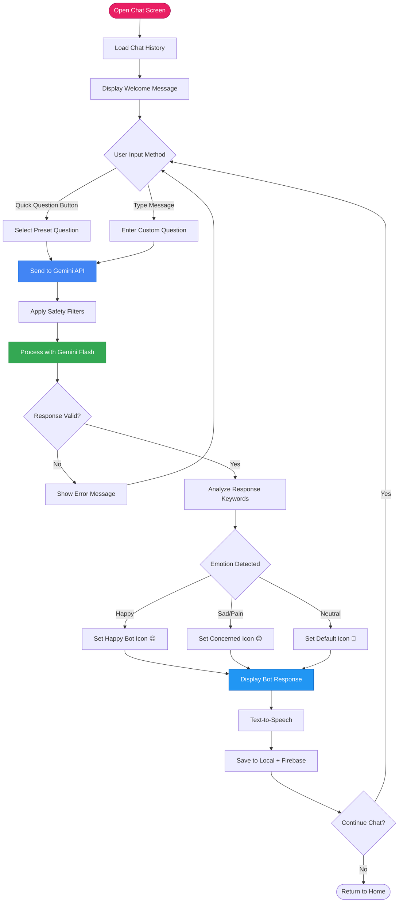
```mermaid
flowchart TD
    A([Open Chat Screen]) --> B[Load Chat History]
    B --> C[Display Welcome Message]

    C --> D{User Input Method}

    D -->|Quick Question Button| E[Select Preset Question]
    D -->|Type Message| F[Enter Custom Question]

    E --> G[Send to Gemini API]
    F --> G

    G --> H[Apply Safety Filters]
    H --> I[Process with Gemini Flash]

    I --> J{Response Valid?}

    J -->|No| K[Show Error Message]
    J -->|Yes| L[Analyze Response Keywords]

    L --> M{Emotion Detected}

    M -->|Happy| N[Set Happy Bot Icon 😊]
    M -->|Sad/Pain| O[Set Concerned Icon 😟]
    M -->|Neutral| P[Set Default Icon 🦷]

    N --> Q[Display Bot Response]
    O --> Q
    P --> Q

    Q --> R[Text-to-Speech]
    R --> S[Save to Local + Firebase]

    S --> T{Continue Chat?}

    T -->|Yes| D
    T -->|No| U([Return to Home])

    K --> D

    style A fill:#E91E63,stroke:#AD1457,color:#fff
    style G fill:#4285F4,stroke:#1A73E8,color:#fff
    style I fill:#34A853,stroke:#1E8E3E,color:#fff
    style Q fill:#2196F3,stroke:#1565C0,color:#fff
```

---

## 10. Overall System Context Diagram

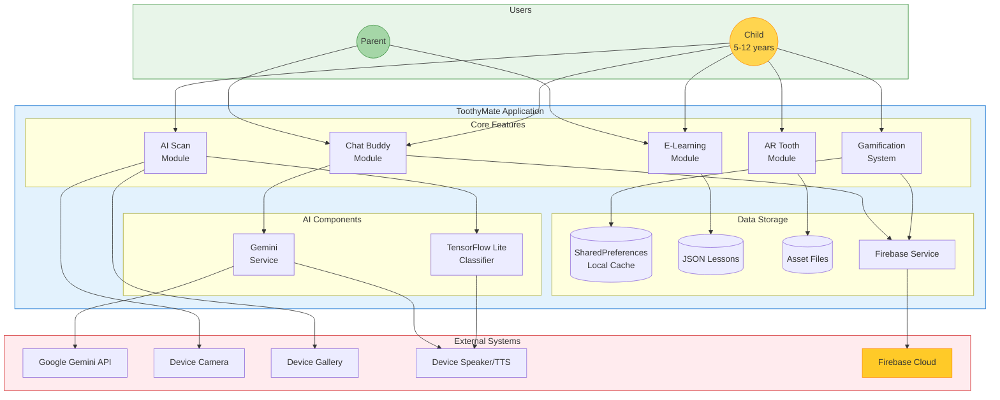
```mermaid
flowchart TB
    subgraph External["External Systems"]
        GEM[Google Gemini API]
        CAM[Device Camera]
        GAL[Device Gallery]
        SPK[Device Speaker/TTS]
        FB[Firebase Cloud]
    end

    subgraph ToothyMate["ToothyMate Application"]
        subgraph Features["Core Features"]
            GM[Gamification<br/>System]
            EL[E-Learning<br/>Module]
            AIS[AI Scan<br/>Module]
            AR[AR Tooth<br/>Module]
            CB[Chat Buddy<br/>Module]
        end

        subgraph AI["AI Components"]
            TFL[TensorFlow Lite<br/>Classifier]
            GS[Gemini<br/>Service]
        end

        subgraph Storage["Data Storage"]
            SP[(SharedPreferences<br/>Local Cache)]
            JS[(JSON Lessons)]
            AS[(Asset Files)]
            FBS[Firebase Service]
        end
    end

    subgraph Users["Users"]
        CH((Child<br/>5-12 years))
        PA((Parent))
    end

    CH --> GM
    CH --> EL
    CH --> AIS
    CH --> AR
    CH --> CB

    PA --> EL
    PA --> CB

    AIS --> CAM
    AIS --> GAL
    AIS --> TFL

    CB --> GS
    GS --> GEM

    GM --> SP
    GM --> FBS
    FBS --> FB
    CB --> FBS
    EL --> JS
    AR --> AS

    TFL --> SPK
    GS --> SPK

    style ToothyMate fill:#E3F2FD,stroke:#1976D2
    style External fill:#FFEBEE,stroke:#D32F2F
    style Users fill:#E8F5E9,stroke:#388E3C
    style CH fill:#FFD54F,stroke:#FF8F00
    style PA fill:#A5D6A7,stroke:#388E3C
    style FB fill:#FFCA28,stroke:#FF8F00
```

---

---

## 11. Firebase Firestore Data Structure

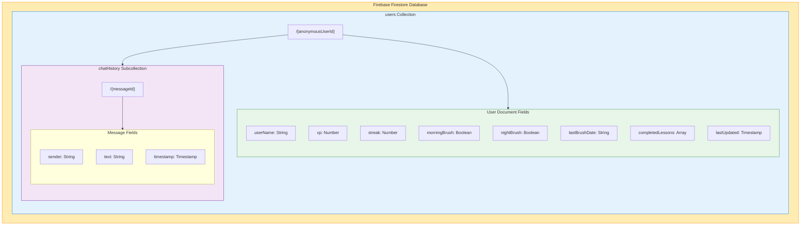
```mermaid
flowchart TB
    subgraph Firestore["Firebase Firestore Database"]
        subgraph Users["users Collection"]
            UID["/{anonymousUserId}"]

            subgraph UserDoc["User Document Fields"]
                UN[userName: String]
                XP[xp: Number]
                ST[streak: Number]
                MB[morningBrush: Boolean]
                NB[nightBrush: Boolean]
                LBD[lastBrushDate: String]
                CL[completedLessons: Array]
                LU[lastUpdated: Timestamp]
            end

            subgraph ChatSub["chatHistory Subcollection"]
                MSG["/{messageId}"]
                subgraph MsgFields["Message Fields"]
                    SND[sender: String]
                    TXT[text: String]
                    TS[timestamp: Timestamp]
                end
            end
        end
    end

    UID --> UserDoc
    UID --> ChatSub
    MSG --> MsgFields

    style Firestore fill:#FFECB3,stroke:#FF8F00
    style Users fill:#E3F2FD,stroke:#1976D2
    style UserDoc fill:#E8F5E9,stroke:#388E3C
    style ChatSub fill:#F3E5F5,stroke:#7B1FA2
```

---

## 12. Technology Stack Diagram

```mermaid
flowchart TB
    subgraph TechStack["ToothyMate Technology Stack"]
        direction TB
        
        subgraph FE["Frontend (Mobile App)"]
            direction LR
            FL[Flutter Framework]
            DA[Dart Language]
            PRO[Provider State Mgmt]
        end

        subgraph BE["Backend & Database"]
            direction LR
            FB[Firebase Cloud]
            FS[Firestore Database]
            SP[SharedPreferences (Local)]
        end

        subgraph AI["Artificial Intelligence"]
            direction LR
            GEM[Google Gemini API]
            TFL[TensorFlow Lite]
            TTS[Text-to-Speech]
        end
        
        subgraph AR["Augmented Reality"]
            direction LR
            ARC[ARCore / ARKit]
            GLB[3D GLB Models]
        end
    end

    style FE fill:#E3F2FD,stroke:#1976D2
    style BE fill:#FFF3E0,stroke:#F57C00
    style AI fill:#E8F5E9,stroke:#388E3C
    style AR fill:#F3E5F5,stroke:#7B1FA2
    
    style FL fill:#fff,stroke:#1976D2
    style FB fill:#fff,stroke:#F57C00
    style GEM fill:#fff,stroke:#388E3C
    style ARC fill:#fff,stroke:#7B1FA2
```

---

## How to Use These Diagrams

1. **Online Editor:** Go to https://mermaid.live/
2. **Copy** the code between the \`\`\`mermaid and \`\`\` tags
3. **Paste** into the editor
4. **Download** as PNG or SVG

### Alternative Tools:
- **VS Code:** Install "Markdown Preview Mermaid Support" extension
- **Draw.io:** Supports Mermaid import
- **Notion:** Native Mermaid support in code blocks
- **GitHub:** Renders Mermaid in markdown files automatically

### Tips:
- You can adjust colors by changing the `fill` and `stroke` values in the `style` lines
- Remove the `style` lines if you want default colors
- The diagrams are fully editable - feel free to modify labels or add/remove nodes
