# Mermaid Diagrams for ToothyMate Thesis

Copy these Mermaid codes and paste them into:
- https://mermaid.live/ (online editor)
- Or any Mermaid-compatible tool to generate the diagrams

---

## 1. Agile Development Cycle Diagram

---

## 2. System Architecture Diagram

---

## 3. Application Main Flowchart

---

## 4. Use Case Diagram

---

## 5. AI Classification Data Flow Diagram

---

## 6. AR Module Flowchart

---

## 7. Gamification System Flowchart

---

## 8. E-Learning Module Flowchart

---

## 9. AI Chatbot Flowchart

```mermaid
flowchart TD
    A([Open Chat Screen]) --> B[Load Chat History]
    B --> C[Display Welcome Message]

    C --> D{User Input Method}

    D -->|Quick Question Button| E[Select Preset Question]
    D -->|Type Message| F[Enter Custom Question]

    E --> G[Send to Gemini API]
    F --> G

    G --> H[Apply Safety Filters]
    H --> I[Process with Gemini Flash]

    I --> J{Response Valid?}

    J -->|No| K[Show Error Message]
    J -->|Yes| L[Analyze Response Keywords]

    L --> M{Emotion Detected}

    M -->|Happy| N[Set Happy Bot Icon 😊]
    M -->|Sad/Pain| O[Set Concerned Icon 😟]
    M -->|Neutral| P[Set Default Icon 🦷]

    N --> Q[Display Bot Response]
    O --> Q
    P --> Q

    Q --> R[Text-to-Speech]
    R --> S[Save to Chat History]

    S --> T{Continue Chat?}

    T -->|Yes| D
    T -->|No| U([Return to Home])

    K --> D

    style A fill:#E91E63,stroke:#AD1457,color:#fff
    style G fill:#4285F4,stroke:#1A73E8,color:#fff
    style I fill:#34A853,stroke:#1E8E3E,color:#fff
    style Q fill:#2196F3,stroke:#1565C0,color:#fff
```

---

## 10. Overall System Context Diagram

---

## How to Use These Diagrams

1. **Online Editor:** Go to https://mermaid.live/
2. **Copy** the code between the \`\`\`mermaid and \`\`\` tags
3. **Paste** into the editor
4. **Download** as PNG or SVG

### Alternative Tools:
- **VS Code:** Install "Markdown Preview Mermaid Support" extension
- **Draw.io:** Supports Mermaid import
- **Notion:** Native Mermaid support in code blocks
- **GitHub:** Renders Mermaid in markdown files automatically

### Tips:
- You can adjust colors by changing the `fill` and `stroke` values in the `style` lines
- Remove the `style` lines if you want default colors
- The diagrams are fully editable - feel free to modify labels or add/remove nodes
