# PlantUML Diagrams for ToothyMate Thesis

Use these PlantUML codes at:
- https://www.plantuml.com/plantuml/uml/
- Or VS Code with PlantUML extension

---

## 1. Gamification System Flowchart (Simplified)


---

## 2. AI Classification Flowchart


---

## 3. AR Module Flowchart


---

## 4. Application Main Flowchart


---

## 5. Use Case Diagram


---

## 6. System Architecture Diagram


---

## 7. E-Learning Module Flowchart


---

## 8. AI Chatbot Flowchart

```plantuml
@startuml Chatbot
skinparam backgroundColor #FEFEFE
skinparam activityBackgroundColor #FFEBEE
skinparam activityBorderColor #D32F2F

start
:Load Chat History;
:Display Welcome;

repeat
  :User Sends Question;
  :Send to Gemini API;
  :Apply Safety Filters;
  :Process Response;

  :Detect Emotion Keywords;

  switch (Emotion?)
  case (Happy)
    :Set Happy Icon 😊;
  case (Sad/Pain)
    :Set Concerned Icon 😟;
  case (Neutral)
    :Set Default Icon 🦷;
  endswitch

  :Display Response;
  :Text-to-Speech;
  :Save to History;

repeat while (Continue Chat?) is (yes)

stop
@enduml
```



---

## 9. Agile Development Cycle


---

## How to Use PlantUML

### Option 1: Online Editor
1. Go to **https://www.plantuml.com/plantuml/uml/**
2. Paste the code (without the ```plantuml wrapper)
3. Click "Submit" to generate
4. Right-click image to save as PNG

### Option 2: VS Code
1. Install "PlantUML" extension
2. Create `.puml` file
3. Press `Alt+D` to preview
4. Export as PNG/SVG

### Option 3: Draw.io
1. Go to draw.io
2. Arrange → Insert → Advanced → PlantUML
3. Paste code and insert

---

## Simplified Mermaid Alternative for Gamification

If you still prefer Mermaid but simpler:


This simplified version has only 11 nodes instead of 20+.
