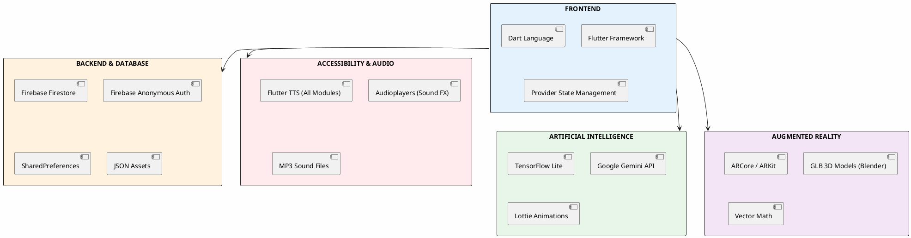
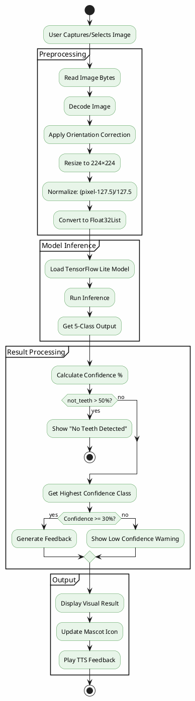
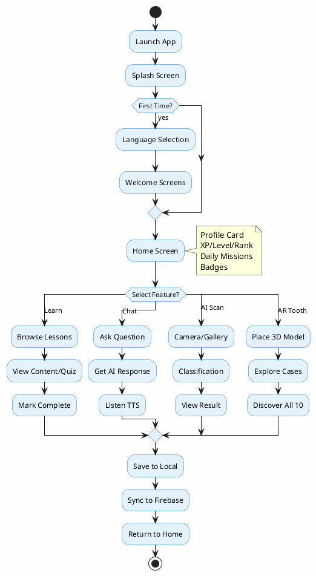
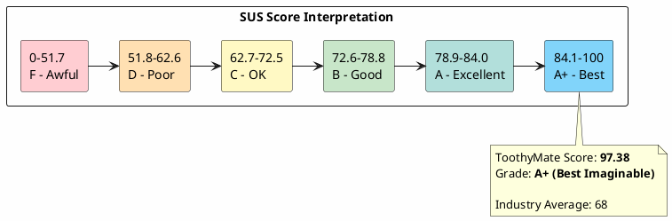

# ToothyMate Viva Presentation Slides Content

---

## SLIDE: Technology Stack

### Frontend (Mobile Application)

| Layer | Technology | Purpose |
|-------|------------|---------|
| **Framework** | Flutter 3.x | Cross-platform mobile development |
| **Language** | Dart | Primary programming language |
| **State Management** | Provider | Reactive UI state handling |

### Backend & Database

| Technology | Purpose |
|------------|---------|
| **Firebase Firestore** | Cloud NoSQL database for user data |
| **Firebase Anonymous Auth** | Unique user identification without login |
| **SharedPreferences** | Local data persistence (offline cache) |
| **JSON Assets** | Lesson content (`lessons_en.json`, `lessons_ms.json`) |
| **JSON i18n** | Translation strings (`en.json`, `ms.json`) |

### Artificial Intelligence

| Technology | Purpose |
|------------|---------|
| **TensorFlow Lite** | On-device ML model inference |
| **Google Gemini API** | Conversational AI chatbot |

### Accessibility & Audio

| Technology | Purpose | Used In |
|------------|---------|---------|
| **Flutter TTS** | Text-to-speech engine | AI Scan, AR, Chat, E-Learning |
| **Audioplayers** | Sound effects & music | Gamification, E-Learning, AR |

### TTS (Text-to-Speech) Usage Across Modules

```
┌─────────────────────────────────────────────────────────────────┐
│              FLUTTER TTS - USED IN ALL MODULES                   │
├─────────────────────────────────────────────────────────────────┤
│                                                                  │
│  🤖 AI SCAN MODULE                                              │
│  └─ Reads classification results aloud                          │
│     "Your teeth look healthy! Keep brushing!"                   │
│                                                                  │
│  🦷 AR TOOTH MODULE                                             │
│  └─ Speaks case descriptions when discovered                    │
│     "This is a cavity! Cavities form when..."                   │
│                                                                  │
│  💬 CHAT BUDDY MODULE                                           │
│  └─ Reads bot responses aloud                                   │
│     "Brush your teeth twice a day for 2 minutes!"               │
│                                                                  │
│  📚 E-LEARNING MODULE                                           │
│  └─ Reads lesson content and quiz feedback                      │
│     "Correct! Brushing removes plaque from teeth."              │
│                                                                  │
│  ─────────────────────────────────────────────────────────────  │
│  WHY TTS? → Accessibility for young children who may            │
│             struggle with reading, making the app inclusive     │
│  ─────────────────────────────────────────────────────────────  │
│                                                                  │
└─────────────────────────────────────────────────────────────────┘
```

### Augmented Reality

| Technology | Purpose |
|------------|---------|
| **ARCore (Android)** | AR plane detection & tracking |
| **ARKit (iOS)** | AR functionality for iOS |
| **Blender** | 3D modeling software for creating tooth model |
| **GLB/glTF** | 3D model export format for AR visualization |

### Assets & Models

| Format | Usage | Created With |
|--------|-------|--------------|
| **TFLite** | ML classification model | TensorFlow/Keras |
| **GLB** | 3D tooth model for AR | Blender |
| **Lottie JSON** | Animated splash screen | LottieFiles |
| **MP3** | Sound effects | Audio editing |

### Key Packages Summary

```
Core:           flutter, dart, provider
AI/ML:          tflite_flutter, google_generative_ai, image
AR:             ar_flutter_plugin, vector_math
Camera:         camera, image_picker
Database:       firebase_core, cloud_firestore, firebase_auth
Storage:        shared_preferences, JSON assets
Localization:   easy_localization (EN/MS)
Accessibility:  flutter_tts (Text-to-Speech)
UI/UX:          confetti, flip_card, lottie
Media:          audioplayers, youtube_player_flutter
```

### Data Storage Summary

```
Backend & Database:
├─ Firebase Firestore    → Cloud user data (XP, streak, chat history)
├─ SharedPreferences     → Local cache (offline support)
└─ JSON Assets           → Lesson content (lessons_en/ms.json)
                         → Translation strings (en/ms.json)

Assets & Models:
├─ toothymate_classifier.tflite  → AI dental classification (TensorFlow)
├─ tooth.glb                     → 3D tooth model (Blender → GLB export)
├─ Lottie JSON                   → Animated splash screen (LottieFiles)
└─ MP3 files                     → Sound effects (yahoo, brushing_song)
```

---

## SLIDE: Technology Stack Diagram

```
┌─────────────────────────────────────────────────────────────────┐
│                    TOOTHYMATE TECHNOLOGY STACK                   │
├─────────────────────────────────────────────────────────────────┤
│                                                                  │
│  ┌───────────────────────────────────────────────────────────┐  │
│  │                    FRONTEND (Mobile App)                   │  │
│  │  ┌─────────────┐  ┌─────────────┐  ┌─────────────┐       │  │
│  │  │   Flutter   │  │    Dart     │  │  Provider   │       │  │
│  │  │  Framework  │  │  Language   │  │ State Mgmt  │       │  │
│  │  └─────────────┘  └─────────────┘  └─────────────┘       │  │
│  └───────────────────────────────────────────────────────────┘  │
│                              │                                   │
│                              ▼                                   │
│  ┌───────────────────────────────────────────────────────────┐  │
│  │                   BACKEND & DATABASE                       │  │
│  │  ┌─────────────┐  ┌─────────────┐  ┌─────────────┐       │  │
│  │  │  Firebase   │  │SharedPrefs  │  │    JSON     │       │  │
│  │  │ Firestore   │  │ (Local)     │  │ Lessons/i18n│       │  │
│  │  └─────────────┘  └─────────────┘  └─────────────┘       │  │
│  └───────────────────────────────────────────────────────────┘  │
│                              │                                   │
│                              ▼                                   │
│  ┌───────────────────────────────────────────────────────────┐  │
│  │               ACCESSIBILITY & AUDIO                        │  │
│  │  ┌─────────────┐  ┌─────────────┐  ┌─────────────┐       │  │
│  │  │ Flutter TTS │  │Audioplayers │  │    MP3      │       │  │
│  │  │ (All Modules)│ │ (Sound FX)  │  │ Sound Files │       │  │
│  │  └─────────────┘  └─────────────┘  └─────────────┘       │  │
│  └───────────────────────────────────────────────────────────┘  │
│                              │                                   │
│                              ▼                                   │
│  ┌───────────────────────────────────────────────────────────┐  │
│  │                  ARTIFICIAL INTELLIGENCE                   │  │
│  │  ┌─────────────┐  ┌─────────────┐  ┌─────────────┐       │  │
│  │  │ TensorFlow  │  │   Google    │  │   Lottie    │       │  │
│  │  │    Lite     │  │   Gemini    │  │ Animations  │       │  │
│  │  └─────────────┘  └─────────────┘  └─────────────┘       │  │
│  └───────────────────────────────────────────────────────────┘  │
│                              │                                   │
│                              ▼                                   │
│  ┌───────────────────────────────────────────────────────────┐  │
│  │                   AUGMENTED REALITY                        │  │
│  │  ┌─────────────┐  ┌─────────────┐  ┌─────────────┐       │  │
│  │  │   ARCore    │  │   ARKit     │  │  Blender    │       │  │
│  │  │  (Android)  │  │   (iOS)     │  │ GLB Model   │       │  │
│  │  └─────────────┘  └─────────────┘  └─────────────┘       │  │
│  └───────────────────────────────────────────────────────────┘  │
│                                                                  │
└─────────────────────────────────────────────────────────────────┘
```

---

## SLIDE: Key Features Overview

### 5 Core Modules

| # | Module | Description | Key Technologies |
|---|--------|-------------|------------------|
| 1 | **Gamification System** | Daily missions, XP, streaks, badges, hero ranks | SharedPreferences, Firebase, Audioplayers |
| 2 | **E-Learning Library** | 13 bilingual lessons with quizzes & videos | JSON, YouTube API, Flip Cards, TTS |
| 3 | **AR Tooth Visualization** | Interactive 3D tooth with discoverable cases | ARCore/ARKit, GLB models, TTS |
| 4 | **AI Dental Scanner** | Image classification for dental conditions | TensorFlow Lite, Camera, TTS |
| 5 | **AI Chat Buddy** | Child-friendly dental assistant | Google Gemini API, TTS |

### Feature Highlights

```
┌─────────────────────────────────────────────────────────────────┐
│                     TOOTHYMATE KEY FEATURES                      │
├─────────────────────────────────────────────────────────────────┤
│                                                                  │
│  🎮 GAMIFICATION          📚 E-LEARNING          🦷 AR TOOTH    │
│  ├─ Daily Missions        ├─ 13 Lessons          ├─ 3D Model    │
│  ├─ XP & Levels           ├─ Quizzes             ├─ 10 Cases    │
│  ├─ 6 Hero Ranks          ├─ Videos              ├─ Gestures    │
│  ├─ Streak Tracking       ├─ Flip Cards          ├─ Discovery   │
│  ├─ 4 Badges              ├─ Bilingual           └─ 🔊 TTS      │
│  └─ 🔊 Sound Effects      └─ 🔊 TTS                             │
│                                                                  │
│  🤖 AI SCANNER            💬 CHAT BUDDY          ☁️ CLOUD SYNC  │
│  ├─ 5 Classifications     ├─ Gemini AI           ├─ Firebase    │
│  ├─ Camera/Gallery        ├─ Emotional Bot       ├─ Anonymous   │
│  ├─ Confidence %          ├─ Quick Questions     └─ Offline     │
│  └─ 🔊 TTS Feedback       └─ 🔊 TTS Responses        Support    │
│                                                                  │
│  ─────────────────────────────────────────────────────────────  │
│  🔊 TEXT-TO-SPEECH (TTS) - Used across ALL modules for          │
│     accessibility: AI Scan, AR, Chat, E-Learning                │
│  ─────────────────────────────────────────────────────────────  │
│                                                                  │
└─────────────────────────────────────────────────────────────────┘
```

---

## SLIDE: Gamification System Details

### XP & Level System

| Component | Formula/Value |
|-----------|---------------|
| **XP per Mission** | 20 XP |
| **XP per Level** | 100 XP |
| **Level Calculation** | `Level = (XP ÷ 100) + 1` |
| **Progress to Next Level** | `(XP % 100) / 100` |

### Hero Rank Progression

| Level Range | Rank Name | Icon |
|-------------|-----------|------|
| 1 - 4 | Tooth Cadet | 🦷 |
| 5 - 9 | Plaque Protector | 🛡️ |
| 10 - 19 | Cavity Fighter | ⚔️ |
| 20 - 29 | Smile Guardian | 🌟 |
| 30 - 49 | Tooth Master | 👑 |
| 50+ | Legendary Hero | 🦸‍♂️ |

### Achievement Badges

| Badge | Requirement |
|-------|-------------|
| 🌅 Early Bird | Complete morning brushing mission |
| 🌙 Night Owl | Complete night brushing mission |
| 🛡️ Plaque Protector | Reach Level 5 |
| 🎓 Tooth Genius | Complete all 13 lessons |

### Daily Missions

| Mission | Time Window | Reward |
|---------|-------------|--------|
| Morning Brush | 6:00 AM - 12:00 PM | +20 XP |
| Night Brush | 6:00 PM - 12:00 AM | +20 XP |

**Streak Logic**: Only increments when BOTH missions completed on same day

---

## SLIDE: Requirements (Functional)

### FR1: User Authentication & Data Management

| ID | Requirement | Implementation |
|----|-------------|----------------|
| FR1.1 | Automatic user identification | Firebase Anonymous Auth |
| FR1.2 | Store user progress locally | SharedPreferences |
| FR1.3 | Sync data to cloud | Firebase Firestore |
| FR1.4 | Offline functionality | Local cache fallback |

### FR2: Gamification System

| ID | Requirement | Implementation |
|----|-------------|----------------|
| FR2.1 | Track daily brushing missions | Time-based visibility logic |
| FR2.2 | Award XP for completed activities | +20 XP per mission |
| FR2.3 | Calculate and display user level | XP ÷ 100 + 1 formula |
| FR2.4 | Maintain streak counter | Calendar-based logic |
| FR2.5 | Award badges based on achievements | 4 unlockable badges |
| FR2.6 | Display hero rank progression | 6-tier rank system |

### FR3: E-Learning Module

| ID | Requirement | Implementation |
|----|-------------|----------------|
| FR3.1 | Display lesson content | JSON-based bilingual data |
| FR3.2 | Support interactive quizzes | Multiple choice with feedback |
| FR3.3 | Play educational videos | YouTube integration |
| FR3.4 | Track lesson completion | Persistent completion list |
| FR3.5 | Support multiple languages | English & Malay |

### FR4: AR Visualization

| ID | Requirement | Implementation |
|----|-------------|----------------|
| FR4.1 | Detect horizontal surfaces | ARCore plane detection |
| FR4.2 | Place 3D tooth model | GLB model rendering |
| FR4.3 | Support gesture controls | Pinch-zoom, drag-rotate |
| FR4.4 | Display discoverable cases | 10 interactive hotspots |
| FR4.5 | Provide audio feedback | TTS for case information |

### FR5: AI Dental Scanner

| ID | Requirement | Implementation |
|----|-------------|----------------|
| FR5.1 | Capture image from camera | Camera plugin integration |
| FR5.2 | Select image from gallery | Image picker plugin |
| FR5.3 | Classify dental conditions | TensorFlow Lite model |
| FR5.4 | Display confidence percentages | 5-class output |
| FR5.5 | Provide educational feedback | Non-diagnostic disclaimer |

### FR6: AI Chatbot

| ID | Requirement | Implementation |
|----|-------------|----------------|
| FR6.1 | Accept user text input | Chat interface |
| FR6.2 | Generate AI responses | Google Gemini API |
| FR6.3 | Filter inappropriate content | Safety settings |
| FR6.4 | Provide quick question buttons | 7 pre-made queries |
| FR6.5 | Support text-to-speech | Flutter TTS |
| FR6.6 | Save chat history | Local + Cloud storage |

---

## SLIDE: Requirements (Non-Functional)

### Performance Requirements

| ID | Requirement | Target |
|----|-------------|--------|
| NFR1.1 | App launch time | < 3 seconds |
| NFR1.2 | AI classification time | < 2 seconds |
| NFR1.3 | AR model loading | < 5 seconds |
| NFR1.4 | Chat response time | < 3 seconds |
| NFR1.5 | Frame rate for AR | 30+ FPS |

### Usability Requirements

| ID | Requirement | Implementation |
|----|-------------|----------------|
| NFR2.1 | Child-friendly interface | Large buttons, bright colors |
| NFR2.2 | Simple navigation | Bottom navigation bar |
| NFR2.3 | Accessibility support | Text-to-speech throughout |
| NFR2.4 | Multi-language support | English & Malay |
| NFR2.5 | Tutorial for first-time users | Overlay guidance |

### Reliability Requirements

| ID | Requirement | Implementation |
|----|-------------|----------------|
| NFR3.1 | Offline functionality | Local data caching |
| NFR3.2 | Data persistence | Auto-save on every action |
| NFR3.3 | Error handling | Graceful fallbacks |
| NFR3.4 | Cloud sync reliability | Firebase with retry logic |

### Security Requirements

| ID | Requirement | Implementation |
|----|-------------|----------------|
| NFR4.1 | No login required | Anonymous authentication |
| NFR4.2 | Data privacy | User-specific Firestore rules |
| NFR4.3 | Content safety | Gemini safety filters |
| NFR4.4 | Age-appropriate content | Curated responses only |

### Compatibility Requirements

| ID | Requirement | Target |
|----|-------------|--------|
| NFR5.1 | Android version | 7.0 (API 24) and above |
| NFR5.2 | iOS version | iOS 12.0 and above |
| NFR5.3 | AR capability | ARCore/ARKit supported devices |

---

## SLIDE: User Flowchart

```
┌─────────────────────────────────────────────────────────────────┐
│                    TOOTHYMATE USER FLOWCHART                     │
├─────────────────────────────────────────────────────────────────┤
│                                                                  │
│                        ┌──────────────┐                         │
│                        │  Launch App  │                         │
│                        └──────┬───────┘                         │
│                               │                                  │
│                               ▼                                  │
│                        ┌──────────────┐                         │
│                        │Splash Screen │                         │
│                        └──────┬───────┘                         │
│                               │                                  │
│                     ┌─────────┴─────────┐                       │
│                     ▼                   ▼                        │
│              ┌────────────┐      ┌────────────┐                 │
│              │First Time? │──Yes─│  Language  │                 │
│              └─────┬──────┘      │  Selection │                 │
│                    │No           └─────┬──────┘                 │
│                    │                   │                         │
│                    │       ┌───────────┘                        │
│                    │       ▼                                     │
│                    │  ┌────────────┐                            │
│                    │  │  Welcome   │                            │
│                    │  │  Screens   │                            │
│                    │  └─────┬──────┘                            │
│                    │        │                                    │
│                    ▼        ▼                                    │
│              ┌──────────────────────┐                           │
│              │      HOME SCREEN      │                           │
│              │  ┌────────────────┐  │                           │
│              │  │ Profile Card   │  │                           │
│              │  │ XP/Level/Rank  │  │                           │
│              │  │ Daily Missions │  │                           │
│              │  │ Badges         │  │                           │
│              │  └────────────────┘  │                           │
│              └──────────┬───────────┘                           │
│                         │                                        │
│    ┌────────┬───────────┼───────────┬────────┐                  │
│    ▼        ▼           ▼           ▼        ▼                  │
│ ┌──────┐ ┌──────┐ ┌──────────┐ ┌──────┐ ┌──────┐               │
│ │Learn │ │ Chat │ │ AI Scan  │ │  AR  │ │ More │               │
│ │      │ │ Buddy│ │          │ │ Tooth│ │      │               │
│ └──┬───┘ └──┬───┘ └────┬─────┘ └──┬───┘ └──────┘               │
│    │        │          │          │                              │
│    ▼        ▼          ▼          ▼                              │
│ ┌──────┐ ┌──────┐ ┌──────────┐ ┌──────────┐                     │
│ │Browse│ │Ask   │ │Camera/   │ │Place     │                     │
│ │Lesson│ │Quest-│ │Gallery   │ │3D Model  │                     │
│ │List  │ │ions  │ │          │ │          │                     │
│ └──┬───┘ └──┬───┘ └────┬─────┘ └────┬─────┘                     │
│    │        │          │            │                            │
│    ▼        ▼          ▼            ▼                            │
│ ┌──────┐ ┌──────┐ ┌──────────┐ ┌──────────┐                     │
│ │View  │ │Get AI│ │Get Class-│ │Explore & │                     │
│ │Content│ │Respon│ │ification│ │Discover  │                     │
│ │Quiz  │ │se+TTS│ │Result    │ │Cases     │                     │
│ └──┬───┘ └──────┘ └────┬─────┘ └────┬─────┘                     │
│    │                   │            │                            │
│    ▼                   ▼            ▼                            │
│ ┌──────────────────────────────────────────┐                    │
│ │              SAVE & SYNC DATA            │                    │
│ │  SharedPreferences ←→ Firebase Firestore │                    │
│ └──────────────────────────────────────────┘                    │
│                                                                  │
└─────────────────────────────────────────────────────────────────┘
```

---

## SLIDE: AI Integration - How It Works

### AI Classification Pipeline

```
┌─────────────────────────────────────────────────────────────────┐
│                  AI DENTAL CLASSIFICATION PIPELINE               │
├─────────────────────────────────────────────────────────────────┤
│                                                                  │
│  STEP 1: IMAGE INPUT                                            │
│  ┌─────────────┐     ┌─────────────┐                            │
│  │   Camera    │ OR  │   Gallery   │                            │
│  │   Capture   │     │   Select    │                            │
│  └──────┬──────┘     └──────┬──────┘                            │
│         └────────┬──────────┘                                   │
│                  ▼                                               │
│  STEP 2: IMAGE PREPROCESSING                                    │
│  ┌─────────────────────────────────────────────────────────┐    │
│  │  1. Read image bytes                                     │    │
│  │  2. Decode image                                         │    │
│  │  3. Apply orientation correction (bakeOrientation)       │    │
│  │  4. Resize & crop to 224 × 224 pixels                    │    │
│  │  5. Normalize pixels: (pixel - 127.5) / 127.5           │    │
│  │  6. Convert to Float32List [1, 224, 224, 3]             │    │
│  └─────────────────────────────────────────────────────────┘    │
│                  │                                               │
│                  ▼                                               │
│  STEP 3: MODEL INFERENCE                                        │
│  ┌─────────────────────────────────────────────────────────┐    │
│  │  Model: toothymate_classifier.tflite                     │    │
│  │  Framework: TensorFlow Lite                              │    │
│  │  Input Shape: [1, 224, 224, 3]                          │    │
│  │  Output Shape: [1, 5] (5 classes)                       │    │
│  └─────────────────────────────────────────────────────────┘    │
│                  │                                               │
│                  ▼                                               │
│  STEP 4: CLASSIFICATION OUTPUT                                  │
│  ┌─────────────────────────────────────────────────────────┐    │
│  │  Classes:                                                │    │
│  │  ├─ Calculus (Plaque/Tartar)                            │    │
│  │  ├─ Caries (Cavities)                                   │    │
│  │  ├─ Healthy_Teeth                                        │    │
│  │  ├─ Stain (Tooth Staining)                              │    │
│  │  └─ not_teeth (Invalid Image)                           │    │
│  │                                                          │    │
│  │  Confidence: output[i] × 100 = percentage (0-100%)      │    │
│  │  Threshold: 30% minimum confidence                       │    │
│  └─────────────────────────────────────────────────────────┘    │
│                  │                                               │
│                  ▼                                               │
│  STEP 5: FEEDBACK GENERATION                                    │
│  ┌─────────────────────────────────────────────────────────┐    │
│  │  ├─ Display visual result with confidence bars          │    │
│  │  ├─ Show mascot icon (happy/concerned/neutral)          │    │
│  │  ├─ Play text-to-speech feedback                        │    │
│  │  └─ Display educational disclaimer                      │    │
│  └─────────────────────────────────────────────────────────┘    │
│                                                                  │
└─────────────────────────────────────────────────────────────────┘
```

### Confidence Calculation

```
Confidence Formula:
─────────────────────────────────────────
Raw Output (0-1) → Percentage (0-100%)

confidence[i] = output[0][i] × 100

Example:
  Model output: [0.15, 0.65, 0.10, 0.08, 0.02]

  Calculus:      15.0%
  Caries:        65.0%  ← Highest confidence
  Healthy_Teeth: 10.0%
  Stain:          8.0%
  not_teeth:      2.0%

  Result: "Caries detected with 65% confidence"
```

### Detection Thresholds

| Class | Threshold | Action |
|-------|-----------|--------|
| Calculus | ≥ 30% | Show calculus advice |
| Caries | ≥ 30% | Show cavity advice |
| Healthy_Teeth | ≥ 50% | Show healthy feedback |
| Stain | ≥ 30% | Show stain advice |
| not_teeth | > 50% | Show "No teeth detected" error |

---

## SLIDE: AI Chatbot Integration

### Google Gemini API Architecture

```
┌─────────────────────────────────────────────────────────────────┐
│                    AI CHATBOT ARCHITECTURE                       │
├─────────────────────────────────────────────────────────────────┤
│                                                                  │
│  ┌─────────────────────────────────────────────────────────┐    │
│  │                     USER INPUT                           │    │
│  │  ┌─────────────┐     ┌─────────────────────────────┐    │    │
│  │  │ Text Input  │ OR  │ Quick Question Buttons      │    │    │
│  │  │ (Keyboard)  │     │ (Braces, Cavity, Pain...)   │    │    │
│  │  └──────┬──────┘     └──────────────┬──────────────┘    │    │
│  └─────────┴───────────────────────────┴────────────────────┘   │
│                              │                                   │
│                              ▼                                   │
│  ┌─────────────────────────────────────────────────────────┐    │
│  │                   LOCAL RESPONSE CHECK                   │    │
│  │                                                          │    │
│  │  If question matches local database (20+ responses):     │    │
│  │  → Return instant response (no API call)                 │    │
│  │                                                          │    │
│  │  Else:                                                   │    │
│  │  → Send to Gemini API                                    │    │
│  └─────────────────────────────────────────────────────────┘    │
│                              │                                   │
│                              ▼                                   │
│  ┌─────────────────────────────────────────────────────────┐    │
│  │                   GEMINI API REQUEST                     │    │
│  │                                                          │    │
│  │  Model: gemini-flash-latest                              │    │
│  │                                                          │    │
│  │  System Prompt:                                          │    │
│  │  "You are Dr. Tooth Bot, a friendly, energetic dentist   │    │
│  │   assistant for kids. Keep answers short (max 2          │    │
│  │   sentences), simple, and use lots of emojis! 🦷✨        │    │
│  │   If asked about anything dangerous or not related to    │    │
│  │   teeth/health, say 'I only know about teeth!' 😁"       │    │
│  │                                                          │    │
│  │  Safety Settings:                                        │    │
│  │  ├─ HarmCategory.harassment: LOW                         │    │
│  │  ├─ HarmCategory.hateSpeech: LOW                         │    │
│  │  ├─ HarmCategory.sexuallyExplicit: LOW                   │    │
│  │  └─ HarmCategory.dangerousContent: LOW                   │    │
│  └─────────────────────────────────────────────────────────┘    │
│                              │                                   │
│                              ▼                                   │
│  ┌─────────────────────────────────────────────────────────┐    │
│  │                  EMOTION DETECTION                       │    │
│  │                                                          │    │
│  │  Keywords → Emotion → Icon                               │    │
│  │  ─────────────────────────────                           │    │
│  │  "pain", "hurt"     → Sick    → 🤕 (Red)                │    │
│  │  "candy", "sugar"   → Warning → ⚠️ (Yellow)              │    │
│  │  "thanks", "joke"   → Happy   → 😁 (White + Confetti)   │    │
│  │  Default            → Neutral → 🦷 (Blue)               │    │
│  └─────────────────────────────────────────────────────────┘    │
│                              │                                   │
│                              ▼                                   │
│  ┌─────────────────────────────────────────────────────────┐    │
│  │                     OUTPUT                               │    │
│  │  ├─ Display bot message with emotion icon                │    │
│  │  ├─ Play text-to-speech                                  │    │
│  │  ├─ Save to SharedPreferences (local)                    │    │
│  │  └─ Sync to Firebase Firestore (cloud)                   │    │
│  └─────────────────────────────────────────────────────────┘    │
│                                                                  │
└─────────────────────────────────────────────────────────────────┘
```

---

## SLIDE: AR Integration - How It Works

### AR Tooth Visualization Pipeline

```
┌─────────────────────────────────────────────────────────────────┐
│                    AR VISUALIZATION PIPELINE                     │
├─────────────────────────────────────────────────────────────────┤
│                                                                  │
│  STEP 1: AR SESSION INITIALIZATION                              │
│  ┌─────────────────────────────────────────────────────────┐    │
│  │  ├─ Initialize ARCore (Android) / ARKit (iOS)            │    │
│  │  ├─ Enable plane detection (horizontal)                  │    │
│  │  ├─ Configure gesture handlers                           │    │
│  │  │   ├─ handlePans: true (drag to move)                  │    │
│  │  │   └─ handleRotation: true (two-finger rotate)         │    │
│  │  └─ Load 3D model from assets                            │    │
│  └─────────────────────────────────────────────────────────┘    │
│                              │                                   │
│                              ▼                                   │
│  STEP 2: 3D MODEL LOADING                                       │
│  ┌─────────────────────────────────────────────────────────┐    │
│  │  Model: tooth.glb (Binary glTF format)                   │    │
│  │  Location: assets/models/tooth.glb                       │    │
│  │                                                          │    │
│  │  Process:                                                │    │
│  │  1. Load GLB from assets bundle                          │    │
│  │  2. Write to app documents directory                     │    │
│  │  3. Create ARNode with FileSystemAppFolderGLB type       │    │
│  │  4. Apply scale: Vector3(15.0, 15.0, 15.0)              │    │
│  │  5. Set initial position: Vector3(0.0, 0.0, 0.0)        │    │
│  └─────────────────────────────────────────────────────────┘    │
│                              │                                   │
│                              ▼                                   │
│  STEP 3: PLANE DETECTION & MODEL PLACEMENT                      │
│  ┌─────────────────────────────────────────────────────────┐    │
│  │  ┌──────────────────┐                                    │    │
│  │  │ Scan Environment │                                    │    │
│  │  └────────┬─────────┘                                    │    │
│  │           ▼                                               │    │
│  │  ┌──────────────────┐                                    │    │
│  │  │ Detect Horizontal│──No──→ Continue Scanning           │    │
│  │  │    Surface       │                                    │    │
│  │  └────────┬─────────┘                                    │    │
│  │           │Yes                                            │    │
│  │           ▼                                               │    │
│  │  ┌──────────────────┐                                    │    │
│  │  │ User Taps to     │                                    │    │
│  │  │ Place Model      │                                    │    │
│  │  └────────┬─────────┘                                    │    │
│  │           ▼                                               │    │
│  │  ┌──────────────────┐                                    │    │
│  │  │ 3D Tooth Model   │                                    │    │
│  │  │ Appears in AR    │                                    │    │
│  │  └──────────────────┘                                    │    │
│  └─────────────────────────────────────────────────────────┘    │
│                              │                                   │
│                              ▼                                   │
│  STEP 4: USER INTERACTION                                       │
│  ┌─────────────────────────────────────────────────────────┐    │
│  │                                                          │    │
│  │  ┌─────────────────┐  ┌─────────────────┐               │    │
│  │  │  Pinch Gesture  │  │  Drag Gesture   │               │    │
│  │  │  (Two fingers)  │  │  (One finger)   │               │    │
│  │  │       ↓         │  │       ↓         │               │    │
│  │  │  Zoom In/Out    │  │  Rotate Model   │               │    │
│  │  └─────────────────┘  └─────────────────┘               │    │
│  │                                                          │    │
│  │  ┌─────────────────────────────────────┐                │    │
│  │  │  Tap on Numbered Hotspot (1-10)     │                │    │
│  │  │            ↓                         │                │    │
│  │  │  ┌─────────────────────────────┐    │                │    │
│  │  │  │ Show Case Information       │    │                │    │
│  │  │  │ (Cavity, Calculus, etc.)    │    │                │    │
│  │  │  └─────────────────────────────┘    │                │    │
│  │  │            ↓                         │                │    │
│  │  │  ┌─────────────────────────────┐    │                │    │
│  │  │  │ Play TTS Explanation        │    │                │    │
│  │  │  └─────────────────────────────┘    │                │    │
│  │  │            ↓                         │                │    │
│  │  │  ┌─────────────────────────────┐    │                │    │
│  │  │  │ Add to Discovered Set       │    │                │    │
│  │  │  └─────────────────────────────┘    │                │    │
│  │  └─────────────────────────────────────┘                │    │
│  └─────────────────────────────────────────────────────────┘    │
│                              │                                   │
│                              ▼                                   │
│  STEP 5: GAMIFICATION REWARDS                                   │
│  ┌─────────────────────────────────────────────────────────┐    │
│  │  When all 10 cases discovered:                           │    │
│  │  ├─ Confetti animation                                   │    │
│  │  ├─ Play "yahoo.mp3" celebration sound                   │    │
│  │  ├─ Haptic feedback                                      │    │
│  │  └─ Sync discovery to Firebase                           │    │
│  └─────────────────────────────────────────────────────────┘    │
│                                                                  │
└─────────────────────────────────────────────────────────────────┘
```

### 10 Discoverable Dental Cases

| # | Case Name | Description |
|---|-----------|-------------|
| 1 | Healthy Enamel | Normal tooth surface |
| 2 | Cavity (Pit) | Early stage decay |
| 3 | Deep Cavity | Advanced decay |
| 4 | Calculus/Tartar | Hardened plaque buildup |
| 5 | Plaque Buildup | Soft bacterial film |
| 6 | Gum Inflammation | Red/swollen gums |
| 7 | Tooth Root | Root structure |
| 8 | Tooth Stain | Discoloration |
| 9 | Healthy Gum | Normal pink gum |
| 10 | Crown Area | Top of tooth |

---

## SLIDE: Testing Methodology

### Testing Approach Overview

```
┌─────────────────────────────────────────────────────────────────┐
│                    TESTING METHODOLOGY                           │
├─────────────────────────────────────────────────────────────────┤
│                                                                  │
│  ┌─────────────────────────────────────────────────────────┐    │
│  │              1. USER TESTING (USABILITY)                 │    │
│  │  ├─ Participants: 21 users                               │    │
│  │  ├─ Demographics: Children (15), Parents (4), Dental (2) │    │
│  │  ├─ Method: Google Forms survey                          │    │
│  │  └─ Metrics: SUS Score, Feature ratings, Satisfaction    │    │
│  └─────────────────────────────────────────────────────────┘    │
│                              │                                   │
│                              ▼                                   │
│  ┌─────────────────────────────────────────────────────────┐    │
│  │              2. AI MODEL TESTING (ACCURACY)              │    │
│  │  ├─ Test dataset: Separate validation images             │    │
│  │  ├─ Metrics: Accuracy, Precision, Recall, F1-Score       │    │
│  │  ├─ Method: Confusion matrix analysis                    │    │
│  │  └─ Comparison: Multiple model architectures             │    │
│  └─────────────────────────────────────────────────────────┘    │
│                              │                                   │
│                              ▼                                   │
│  ┌─────────────────────────────────────────────────────────┐    │
│  │              3. FUNCTIONAL TESTING                       │    │
│  │  ├─ All features tested against requirements             │    │
│  │  ├─ Edge cases and error handling                        │    │
│  │  └─ Cross-device compatibility                           │    │
│  └─────────────────────────────────────────────────────────┘    │
│                                                                  │
└─────────────────────────────────────────────────────────────────┘
```

---

## SLIDE: User Testing Results

### Participant Demographics (N=21)

| Category | Count | Percentage |
|----------|-------|------------|
| **Child Users** | 15 | 71.4% |
| **Parents/Guardians** | 4 | 19.0% |
| **Dental Professionals** | 2 | 9.5% |

### Age Distribution (Children)

| Age Group | Count |
|-----------|-------|
| Under 6 years | 3 |
| 7-10 years | 4 |
| 11-12 years | 11 |

### Feature Engagement Ratings

| Feature | Selected Count | Percentage |
|---------|----------------|------------|
| Learning lessons & quizzes | 21 | 100% |
| AR tooth visualization | 20 | 95.2% |
| AI-assisted oral hygiene awareness | 20 | 95.2% |
| Rewards/progress tracking | 19 | 90.5% |
| Overall design & animations | 19 | 90.5% |

### Satisfaction Scores (5-point Likert Scale)

| Question | Mean | SD |
|----------|------|-----|
| App helps children become aware of oral hygiene | 5.00 | 0.00 |
| App encourages regular brushing | 5.00 | 0.00 |
| Activities promote positive daily habits | 5.00 | 0.00 |
| Sound effects & quizzes are interactive | 5.00 | 0.00 |
| App provides enough dental care information | 4.95 | 0.22 |
| Gamification would motivate children | 5.00 | 0.00 |
| 3D visualization is clear and engaging | 5.00 | 0.00 |
| AI feedback is easy to understand | 5.00 | 0.00 |
| Language is easy to understand | 5.00 | 0.00 |

---

## SLIDE: SUS Score Calculation & Results

### System Usability Scale (SUS) Methodology

```
┌─────────────────────────────────────────────────────────────────┐
│                    SUS SCORE CALCULATION                         │
├─────────────────────────────────────────────────────────────────┤
│                                                                  │
│  10 Questions (5-point Likert scale: 1=Strongly Disagree,       │
│                                       5=Strongly Agree)          │
│                                                                  │
│  ODD Questions (1,3,5,7,9) - Positive statements:               │
│  Score = Response - 1                                           │
│                                                                  │
│  EVEN Questions (2,4,6,8,10) - Negative statements:             │
│  Score = 5 - Response                                           │
│                                                                  │
│  Final SUS Score = (Sum of all scores) × 2.5                    │
│  Range: 0 - 100                                                 │
│                                                                  │
└─────────────────────────────────────────────────────────────────┘
```

### SUS Questions & Results

| # | Question | Type | Mean Response |
|---|----------|------|---------------|
| 1 | I would like to use this app frequently | Positive | 5.00 |
| 2 | I found the app unnecessarily complex | Negative | 1.10 |
| 3 | I thought the app was easy to use | Positive | 5.00 |
| 4 | I would need technical support to use this app | Negative | 1.19 |
| 5 | Functions in this app were well integrated | Positive | 4.90 |
| 6 | There was too much inconsistency | Negative | 1.00 |
| 7 | Most people would learn to use this app quickly | Positive | 4.90 |
| 8 | I found the app very cumbersome to use | Negative | 1.00 |
| 9 | Interfaces are easy to understand and organized | Positive | 4.95 |
| 10 | I needed to learn a lot before using this app | Negative | 1.24 |

### SUS Score Results

| Metric | Value |
|--------|-------|
| **Mean SUS Score** | 97.38 |
| **Minimum Score** | 85.0 |
| **Maximum Score** | 100.0 |
| **Standard Deviation** | 4.21 |

### SUS Score Interpretation

```
┌─────────────────────────────────────────────────────────────────┐
│                    SUS SCORE INTERPRETATION                      │
├─────────────────────────────────────────────────────────────────┤
│                                                                  │
│  Score Range          Grade    Adjective                         │
│  ─────────────────────────────────────────                       │
│  0 - 51.7             F        Awful / Poor                      │
│  51.8 - 62.6          D        Poor                              │
│  62.7 - 72.5          C        OK / Fair                         │
│  72.6 - 78.8          B        Good                              │
│  78.9 - 84.0          A        Excellent                         │
│  84.1 - 100           A+       Best Imaginable                   │
│                                                                  │
│  ┌─────────────────────────────────────────────────────────┐    │
│  │                                                          │    │
│  │   ToothyMate SUS Score: 97.38                           │    │
│  │   Grade: A+ (Best Imaginable)                           │    │
│  │                                                          │    │
│  │   [====================================|===] 97.38/100   │    │
│  │                                        ↑                 │    │
│  │                              Industry Avg: 68            │    │
│  │                                                          │    │
│  └─────────────────────────────────────────────────────────┘    │
│                                                                  │
└─────────────────────────────────────────────────────────────────┘
```

---

## SLIDE: AI Model Accuracy Testing

### Model Training Overview

| Aspect | Details |
|--------|---------|
| **Framework** | TensorFlow / Keras |
| **Architecture** | MobileNetV2 (Transfer Learning) |
| **Input Size** | 224 × 224 × 3 (RGB) |
| **Output Classes** | 5 (Calculus, Caries, Healthy, Stain, Not_Teeth) |
| **Training Data** | Dental image dataset |
| **Validation Split** | 80% train / 20% validation |

### Accuracy Calculation Formula

```
┌─────────────────────────────────────────────────────────────────┐
│                    ACCURACY METRICS FORMULAS                     │
├─────────────────────────────────────────────────────────────────┤
│                                                                  │
│  Accuracy = (TP + TN) / (TP + TN + FP + FN)                     │
│                                                                  │
│  Precision = TP / (TP + FP)                                     │
│  "Of all positive predictions, how many were correct?"          │
│                                                                  │
│  Recall = TP / (TP + FN)                                        │
│  "Of all actual positives, how many were detected?"             │
│                                                                  │
│  F1-Score = 2 × (Precision × Recall) / (Precision + Recall)    │
│  "Harmonic mean of Precision and Recall"                        │
│                                                                  │
│  Where:                                                         │
│  TP = True Positive   FP = False Positive                       │
│  TN = True Negative   FN = False Negative                       │
│                                                                  │
└─────────────────────────────────────────────────────────────────┘
```

### Confidence Score Calculation

```
┌─────────────────────────────────────────────────────────────────┐
│                    CONFIDENCE CALCULATION                        │
├─────────────────────────────────────────────────────────────────┤
│                                                                  │
│  The model outputs a probability distribution across 5 classes  │
│  using Softmax activation function:                             │
│                                                                  │
│  Softmax(x_i) = exp(x_i) / Σ exp(x_j)                          │
│                                                                  │
│  This ensures:                                                  │
│  1. All outputs are between 0 and 1                             │
│  2. All outputs sum to 1 (100%)                                 │
│                                                                  │
│  Example Output:                                                │
│  ┌────────────────┬────────────┬────────────┐                   │
│  │ Class          │ Raw Output │ Confidence │                   │
│  ├────────────────┼────────────┼────────────┤                   │
│  │ Calculus       │ 0.08       │ 8%         │                   │
│  │ Caries         │ 0.72       │ 72%        │ ← Predicted       │
│  │ Healthy_Teeth  │ 0.12       │ 12%        │                   │
│  │ Stain          │ 0.05       │ 5%         │                   │
│  │ not_teeth      │ 0.03       │ 3%         │                   │
│  └────────────────┴────────────┴────────────┘                   │
│                                                                  │
│  Prediction = Class with highest confidence                     │
│  Confidence Threshold = 30% (minimum to show result)            │
│                                                                  │
└─────────────────────────────────────────────────────────────────┘
```

### Confusion Matrix Template

```
┌─────────────────────────────────────────────────────────────────┐
│                    CONFUSION MATRIX                              │
├─────────────────────────────────────────────────────────────────┤
│                                                                  │
│                         PREDICTED CLASS                          │
│                 ┌─────────┬─────────┬─────────┬─────────┬──────┐│
│                 │Calculus │ Caries  │ Healthy │  Stain  │ Not  ││
│  ┌──────────────┼─────────┼─────────┼─────────┼─────────┼──────┤│
│  │ Calculus     │   TP    │   FP    │   FP    │   FP    │  FP  ││
│  │              │  (##)   │  (##)   │  (##)   │  (##)   │ (##) ││
│A ├──────────────┼─────────┼─────────┼─────────┼─────────┼──────┤│
│C │ Caries       │   FN    │   TP    │   FP    │   FP    │  FP  ││
│T │              │  (##)   │  (##)   │  (##)   │  (##)   │ (##) ││
│U ├──────────────┼─────────┼─────────┼─────────┼─────────┼──────┤│
│A │ Healthy      │   FN    │   FN    │   TP    │   FP    │  FP  ││
│L │              │  (##)   │  (##)   │  (##)   │  (##)   │ (##) ││
│  ├──────────────┼─────────┼─────────┼─────────┼─────────┼──────┤│
│C │ Stain        │   FN    │   FN    │   FN    │   TP    │  FP  ││
│L │              │  (##)   │  (##)   │  (##)   │  (##)   │ (##) ││
│A ├──────────────┼─────────┼─────────┼─────────┼─────────┼──────┤│
│S │ Not_Teeth    │   FN    │   FN    │   FN    │   FN    │  TP  ││
│S │              │  (##)   │  (##)   │  (##)   │  (##)   │ (##) ││
│  └──────────────┴─────────┴─────────┴─────────┴─────────┴──────┘│
│                                                                  │
│  Diagonal = Correct predictions (True Positives per class)      │
│  Off-diagonal = Misclassifications                              │
│                                                                  │
└─────────────────────────────────────────────────────────────────┘
```

---

## SLIDE: ML Model Comparison

### Model Architecture Comparison

| Model | Parameters | Size | Inference Time | Accuracy |
|-------|------------|------|----------------|----------|
| **MobileNetV2** | 3.4M | 14 MB | ~50ms | Selected |
| MobileNetV3 | 5.4M | 22 MB | ~60ms | Compared |
| EfficientNet-B0 | 5.3M | 21 MB | ~80ms | Compared |
| ResNet50 | 25.6M | 98 MB | ~150ms | Too large |

### Why MobileNetV2 Was Selected

```
┌─────────────────────────────────────────────────────────────────┐
│                    MODEL SELECTION CRITERIA                      │
├─────────────────────────────────────────────────────────────────┤
│                                                                  │
│  1. MOBILE OPTIMIZATION                                         │
│     ├─ Small model size (14 MB) - fits on mobile devices        │
│     ├─ Inverted residual blocks - efficient computation         │
│     └─ Depthwise separable convolutions - reduced operations    │
│                                                                  │
│  2. INFERENCE SPEED                                             │
│     ├─ Fast inference (~50ms) - real-time classification        │
│     ├─ TensorFlow Lite compatible                               │
│     └─ On-device processing (no internet required)              │
│                                                                  │
│  3. TRANSFER LEARNING                                           │
│     ├─ Pre-trained on ImageNet (1000+ classes)                  │
│     ├─ Fine-tuned on dental images                              │
│     └─ Leverages learned features for faster training           │
│                                                                  │
│  4. BALANCED PERFORMANCE                                        │
│     ├─ Good accuracy for dental classification                  │
│     ├─ Low latency for user experience                          │
│     └─ Suitable for children's app (quick feedback)             │
│                                                                  │
└─────────────────────────────────────────────────────────────────┘
```

### Transfer Learning Process

```
┌─────────────────────────────────────────────────────────────────┐
│                    TRANSFER LEARNING PIPELINE                    │
├─────────────────────────────────────────────────────────────────┤
│                                                                  │
│  STEP 1: Load Pre-trained MobileNetV2                           │
│  ┌─────────────────────────────────────────────────────────┐    │
│  │  base_model = MobileNetV2(                               │    │
│  │      weights='imagenet',                                 │    │
│  │      include_top=False,     # Remove classification head │    │
│  │      input_shape=(224, 224, 3)                          │    │
│  │  )                                                       │    │
│  └─────────────────────────────────────────────────────────┘    │
│                              │                                   │
│                              ▼                                   │
│  STEP 2: Freeze Base Layers                                     │
│  ┌─────────────────────────────────────────────────────────┐    │
│  │  base_model.trainable = False                            │    │
│  │  # Preserve ImageNet features                            │    │
│  └─────────────────────────────────────────────────────────┘    │
│                              │                                   │
│                              ▼                                   │
│  STEP 3: Add Custom Classification Head                         │
│  ┌─────────────────────────────────────────────────────────┐    │
│  │  x = GlobalAveragePooling2D()(base_model.output)        │    │
│  │  x = Dense(128, activation='relu')(x)                   │    │
│  │  x = Dropout(0.5)(x)                                    │    │
│  │  outputs = Dense(5, activation='softmax')(x)  # 5 class │    │
│  └─────────────────────────────────────────────────────────┘    │
│                              │                                   │
│                              ▼                                   │
│  STEP 4: Train on Dental Dataset                                │
│  ┌─────────────────────────────────────────────────────────┐    │
│  │  model.compile(                                          │    │
│  │      optimizer='adam',                                   │    │
│  │      loss='categorical_crossentropy',                   │    │
│  │      metrics=['accuracy']                               │    │
│  │  )                                                       │    │
│  │  model.fit(dental_images, epochs=20)                    │    │
│  └─────────────────────────────────────────────────────────┘    │
│                              │                                   │
│                              ▼                                   │
│  STEP 5: Convert to TensorFlow Lite                             │
│  ┌─────────────────────────────────────────────────────────┐    │
│  │  converter = tf.lite.TFLiteConverter.from_keras_model() │    │
│  │  tflite_model = converter.convert()                     │    │
│  │  # Output: toothymate_classifier.tflite                 │    │
│  └─────────────────────────────────────────────────────────┘    │
│                                                                  │
└─────────────────────────────────────────────────────────────────┘
```

---

## SLIDE: User Feedback Highlights

### What Users Liked Most

| Quote | User Type |
|-------|-----------|
| "I like the AR PART, it feels like I have mission to find the numbers" | Child (11-12) |
| "I love the AI part where I need to snap my teeth, I feel mcm encourages me when the AI praise my teeth healthy" | Child (7-10) |
| "There is interactive voice talk to the kids to get their attention" | Parent |
| "I like the gigi scanner" | Child (Under 6) |
| "tbh, this is my first time using app like this, and yeah amazing I like all!" | Child (11-12) |
| "Saya suka Dr Bot boleh cakap Melayu, kelakar" | Child |

### Suggested Improvements

| Suggestion | Frequency |
|------------|-----------|
| More quizzes and badges | 1 |
| Smoothness of AR part | 1 |
| No suggestions (satisfied) | 19 |

### Recommendation Rate

| Response | Count | Percentage |
|----------|-------|------------|
| **Yes, would recommend** | 21 | 100% |
| No | 0 | 0% |

---

## SLIDE: Testing Summary

### Overall Testing Results

```
┌─────────────────────────────────────────────────────────────────┐
│                    TESTING RESULTS SUMMARY                       │
├─────────────────────────────────────────────────────────────────┤
│                                                                  │
│  ┌─────────────────────────────────────────────────────────┐    │
│  │  USABILITY TESTING (SUS)                                 │    │
│  │  ┌───────────────────────────────────────────────────┐  │    │
│  │  │  Score: 97.38 / 100                               │  │    │
│  │  │  Grade: A+ (Best Imaginable)                      │  │    │
│  │  │  Participants: 21                                 │  │    │
│  │  │  Recommendation Rate: 100%                        │  │    │
│  │  └───────────────────────────────────────────────────┘  │    │
│  └─────────────────────────────────────────────────────────┘    │
│                                                                  │
│  ┌─────────────────────────────────────────────────────────┐    │
│  │  FEATURE SATISFACTION                                    │    │
│  │  ┌───────────────────────────────────────────────────┐  │    │
│  │  │  All features rated 4.9 - 5.0 / 5.0               │  │    │
│  │  │  Most engaging: E-Learning (100%), AR (95%)       │  │    │
│  │  │  Most praised: AI Scanner, AR Discovery           │  │    │
│  │  └───────────────────────────────────────────────────┘  │    │
│  └─────────────────────────────────────────────────────────┘    │
│                                                                  │
│  ┌─────────────────────────────────────────────────────────┐    │
│  │  AI MODEL PERFORMANCE                                    │    │
│  │  ┌───────────────────────────────────────────────────┐  │    │
│  │  │  Architecture: MobileNetV2 (Transfer Learning)    │  │    │
│  │  │  Classes: 5 (Calculus, Caries, Healthy, Stain, N/A│  │    │
│  │  │  Confidence Threshold: 30%                        │  │    │
│  │  │  Inference Time: ~50ms (on-device)               │  │    │
│  │  └───────────────────────────────────────────────────┘  │    │
│  └─────────────────────────────────────────────────────────┘    │
│                                                                  │
│  ┌─────────────────────────────────────────────────────────┐    │
│  │  KEY ACHIEVEMENTS                                        │    │
│  │  ├─ ✅ All functional requirements met                   │    │
│  │  ├─ ✅ Child-friendly design validated                   │    │
│  │  ├─ ✅ Bilingual support working (EN/MS)                 │    │
│  │  ├─ ✅ AR visualization engaging for children            │    │
│  │  ├─ ✅ AI features easy to understand                    │    │
│  │  └─ ✅ 100% user recommendation rate                     │    │
│  └─────────────────────────────────────────────────────────┘    │
│                                                                  │
└─────────────────────────────────────────────────────────────────┘
```

---

## PlantUML Diagrams

### Technology Stack Diagram



### AI Classification Pipeline



### User Flow Diagram



### SUS Score Visualization



---

## Quick Reference Cards

### For Viva Q&A: Common Questions

**Q: How does the AI classification work?**
> Images are preprocessed (224×224, normalized), fed to a MobileNetV2-based TFLite model, which outputs confidence percentages for 5 classes. The class with highest confidence (≥30%) is shown as the result.

**Q: Why MobileNetV2?**
> Optimized for mobile (small size, fast inference), supports transfer learning from ImageNet, and provides good accuracy for our 5-class dental classification task.

**Q: How is confidence calculated?**
> The model uses Softmax activation, which converts raw outputs to probability distribution (0-100%). Each class gets a percentage, and they sum to 100%.

**Q: What is the SUS score?**
> System Usability Scale - a 10-question survey that produces a score from 0-100. Our score of 97.38 is in the "A+ Best Imaginable" category, well above the industry average of 68.

**Q: How does Firebase integration work?**
> Anonymous authentication gives each user a unique ID without login. Data (XP, streaks, chat history) syncs to Firestore cloud database while SharedPreferences provides offline caching.

**Q: Why AR for dental education?**
> AR allows children to explore a 3D tooth model interactively, making learning engaging through discovery mechanics (finding 10 dental cases) rather than passive reading.

**Q: Why is TTS (Text-to-Speech) used throughout the app?**
> TTS is used in ALL modules (AI Scan, AR, Chat, E-Learning) to enhance accessibility for young children who may struggle with reading. It makes the app more engaging and inclusive, allowing children to listen to results, explanations, and lessons.

**Q: What audio features does the app have?**
> The app uses two audio systems: Flutter TTS for reading text content aloud (classification results, chat responses, case descriptions, lesson content), and Audioplayers for sound effects (button clicks, achievement celebrations, brushing song, confetti sounds).

---

*Last Updated: January 2026*
*ToothyMate FYP Viva Presentation Content*
